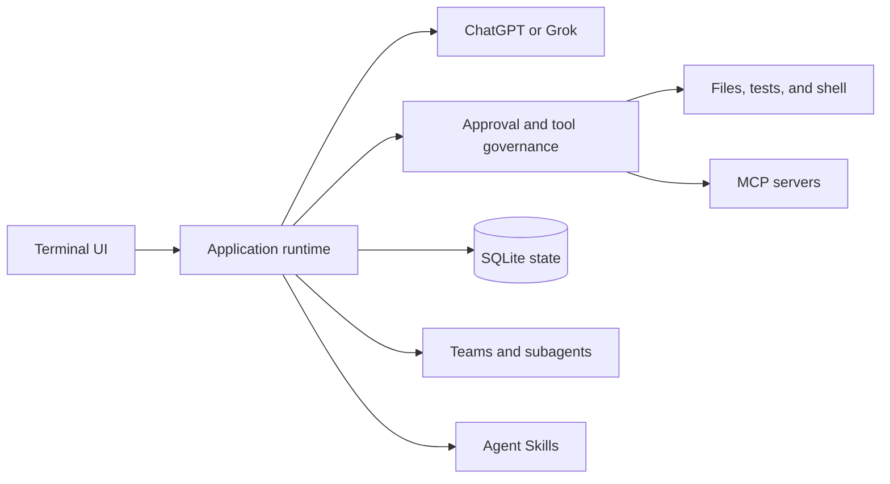

<div align="center">

# Azem

**A local-first AI coding agent for your terminal.**

Governed tools, durable sessions, crash recovery, MCP integrations, Agent Skills, and multi-agent workflows - all from a keyboard-driven TUI.

[](https://go.dev/)
[](LICENSE)

</div>

> [!WARNING]
> Azem can read and modify files, run shell commands, and access the network when permitted. Commit or back up important work, and review the [security model](#security-model) before enabling permissive policies.

## Why Azem?

Azem is designed for coding work that needs more than a chat window. It combines model-driven development with explicit approval policies and persistent execution records, so tool calls remain visible, recoverable, and easier to audit.

| Capability | What it provides |
|---|---|
| **Terminal-native workflow** | A fast Bubble Tea interface with streaming output, dedicated approval cards, concise tool summaries, colorized inline diffs, and token usage |
| **Governed execution** | Prompt, Auto Review, and YOLO approval modes for file, shell, and external actions |
| **Durable state** | SQLite-backed sessions, runs, approvals, leases, and crash recovery |
| **Multiple providers** | ChatGPT through Codex-compatible OAuth and Grok through API or CLI-proxy transport |
| **Extensible tools** | MCP servers over stdio or Streamable HTTP, plus dynamically loaded Agent Skills |
| **Multi-agent work** | Structured team mode and resumable subagents with optional Git worktree isolation |

## Quick Start

### 1. Build Azem

Requirements:

- Go 1.25.8 or later; the project recommends the Go 1.25.12 toolchain
- A supported ChatGPT or Grok account or existing credential
- Git when using subagent worktree isolation

```bash
git clone https://github.com/Viking602/azem.git
cd azem
go build -o azem ./cmd/azem
```

### 2. Start it in a project

Azem uses the directory from which it starts as the workspace.

```bash
cd /path/to/your/project
/path/to/azem
```

You can also run it directly from the source tree:

```bash
go run ./cmd/azem
```

### 3. Connect a provider

Sign in from the TUI:

```text
/login chatgpt
/login grok
```

Or import credentials from an existing Codex or Grok installation:

```text
/login chatgpt --import-codex
/login grok --import
```

Azem searches `CODEX_HOME` (or `~/.codex`) for Codex credentials and `~/.grok` for Grok credentials. Grok's OAuth-compatible flow is experimental and is not a stable third-party authentication contract provided specifically for Azem.

### 4. Ask for a change

Enter a request such as:

```text
Inspect this project, fix the failing tests, and explain the changes.
```

Azem streams progress in the terminal and asks for approval when the selected policy requires it.

## Core Features

- File discovery, reading, searching, patch editing, formatting, testing, and shell execution
- Streaming model output, reasoning state, tool activity, approval decisions, and usage information
- Collapsible, colorized inline diffs with file paths and added/deleted line counts
- Concise tool summaries that avoid flooding the transcript with raw patches or file contents
- Persistent conversations with session resume, context compaction, and a visible per-session recap status line
- Durable action attempts and reconciliation of unknown side effects after interruption
- Retry handling for transient ChatGPT transport failures before output is emitted
- MCP server discovery, reconnect, concurrency controls, and per-tool policies
- Agent Skills discovery from user, project, configured, and bundled directories
- Planner, Implementer, Reviewer, and Reporter team workflow
- Background subagents with role, persona, model, budget, resume, and cancellation controls
- Optional detached Git worktrees for isolated subagent changes

## Terminal Workflow

Azem keeps review context in the conversation instead of hiding it behind raw tool payloads:

- **Approval cards** show the requested action and target as a separate lifecycle from the tool execution. Auto Review cards move from reviewing to Allowed, Denied, Timed out, or Review failed, and include risk and rationale when available.
- **Inline file diffs** turn successful patch edits and newly created files into collapsible transcript blocks. Each block identifies the affected file, reports `+added/-deleted` totals, and colorizes changed lines.
- **Compact tool activity** summarizes file reads, searches, tests, shell commands, edits, and failures. Large patch bodies and complete file contents stay out of routine status messages.
- **Subagent visibility** applies the same summaries and file-diff presentation when inspecting child-agent activity.

## How It Works



Each turn is routed through the application runtime, which selects a provider, assembles the available tools, applies approval policy, persists execution state, and streams events back to the TUI. Structured tool results are projected into readable summaries and file diffs. If execution is interrupted, Azem uses the persisted state to recover runs and surface side effects that require reconciliation.

### Provider stream resilience

For ChatGPT, Azem retries transient stream-opening and transport failures up to five times when no response output has been emitted. This includes connection resets, temporary network errors, interrupted streams, and selected TLS transport failures. Cancellation, deadlines, invalid requests, and certificate validation errors are not retried. After any output has been emitted, Azem does not replay the request, avoiding duplicate partial responses or tool activity.

## Usage

### Command-line options

```text
azem [-config /path/to/config.yaml]
azem -version
```

| Option | Description |
|---|---|
| `-config` | Load a specific YAML configuration file |
| `-version` | Print build version information |

Without `-config`, Azem reads `azem/config.yaml` from the operating system's user configuration directory. If the file does not exist, built-in defaults are used.

### Keyboard shortcuts

| Shortcut | Action |
|---|---|
| `Enter` | Submit input or confirm a selection |
| `Ctrl+J` | Insert a newline |
| `Esc` | Close a dialog or cancel the active run |
| `Ctrl+C` | Cancel the active run, or quit while idle |
| `Ctrl+P` | Open the command palette |
| `Ctrl+M` | Select a model |
| `Ctrl+R` | Select reasoning effort |
| `Ctrl+B` | Inspect subagents |
| `Shift+Tab` | Cycle the approval mode |
| `PageUp` / `PageDown` | Scroll through conversation history |
| `Ctrl+Home` / `Ctrl+End` | Jump to the beginning or end |
| `?` | Open help when the input is empty |

### Slash commands

| Command | Description |
|---|---|
| `/models` | Search for and select a model |
| `/provider [chatgpt\|grok]` | Switch providers |
| `/reasoning [level]` | Set reasoning effort |
| `/login [provider]` | Sign in or import provider credentials |
| `/logout [provider]` | Sign out of a provider account |
| `/skills [reload]` | Inspect or reload Agent Skills |
| `/skill <name> [instruction]` | Activate a Skill and run one turn |
| `/team on\|off` | Enable or disable team mode |
| `/agents [cancel <id>]` | Inspect or cancel subagents |
| `/agent-types` | Inspect available subagent types |
| `/personas` | Inspect subagent personas |
| `/new` | Create a new session |
| `/sessions` | List saved sessions |
| `/resume` | Resume a saved session |
| `/compact` | Compact the current session context |
| `/memory [query]` | Search workspace-native memory |
| `/remember <text>` | Save explicit evidence to workspace memory |
| `/forget <memory-id>` | Remove one workspace memory |
| `/recap` | Inspect the current session continuity recap |
| `/mcp [refresh\|reconnect <server>]` | Inspect or update MCP servers |
| `/reconcile <attempt-id> <result>` | Reconcile an unknown side effect |
| `/cancel` | Cancel the active run |
| `/help` | Open help |
| `/quit` | Quit Azem |

## Configuration

Pass a custom configuration file with:

```bash
azem -config ./config.yaml
```

Azem rejects unknown fields, unsupported enum values, malformed durations, and invalid MCP settings. Relative workspace and Skill paths are resolved from the configuration file directory.

```yaml
version: 1

defaults:
  provider: chatgpt
  model: gpt-5.6-sol
  reasoning: high
  agent_mode: single       # single | team

workspace:
  root: .
  allow_write: true
  shell_policy: prompt     # prompt | deny | allow
  allow_network: prompt    # prompt | deny | allow

auth:
  store: keyring           # sqlite | keyring | file
  import_codex: true
  import_grok: true

agents:
  main:
    max_tokens: 0          # 0 means unbounded
    max_tool_calls: 0      # 0 means unbounded
    max_wall_clock: 0s     # 0s means unbounded; e.g. 45m sets a per-turn limit
  team:
    max_concurrency: 2
    max_ticks: 12
  subagents:
    enabled: true
    max_depth: 1
    max_concurrency: 2
    await_timeout: 10m
    auto_wake: true
    budget:
      max_tokens: 128000
      max_tool_calls: 64
      max_turns: 32
      max_wall_clock: 20m

skills:
  enabled: true
  trust_project: true
  additional_dirs: []
  eager: []
  disabled: []

mcp:
  servers: {}
```

### Approval modes

Use `Shift+Tab` to cycle between modes:

| Mode | Behavior |
|---|---|
| **Prompt** | Ask the user before governed actions |
| **Auto Review** | Ask an authenticated reviewer model to assess actions and show its decision, risk, and rationale in the transcript |
| **YOLO** | Approve actions automatically; use only in trusted environments |

The configured tool effect and approval policy still determine which operations enter the approval flow. Approval cards remain separate from subsequent tool and diff blocks, so a review decision is not mistaken for completed execution.

## MCP Integrations

Azem supports local stdio servers and remote Streamable HTTP servers.

### stdio

```yaml
mcp:
  servers:
    local_tools:
      enabled: true
      transport: stdio
      command: /path/to/mcp-server
      args: []
      inherit_env: true
      connect_timeout: 30s
      call_timeout: 60s
      max_concurrency: 2
      approval: always
```

### Streamable HTTP

```yaml
mcp:
  servers:
    remote_tools:
      enabled: true
      transport: streamable_http
      url: https://example.com/mcp
      headers:
        Authorization: env:MCP_AUTHORIZATION
      connect_timeout: 30s
      call_timeout: 60s
      max_concurrency: 2
      approval: always
```

Secrets must be references rather than literal values:

- `env:NAME` reads an environment variable.
- `keyring:NAME` reads an entry from the system keyring.

Remote MCP URLs must use HTTPS. Plain HTTP is accepted only for localhost or loopback addresses.

## Data and Credentials

Azem follows operating-system user-directory conventions and creates an `azem` subdirectory:

| Data | Location |
|---|---|
| Configuration | `azem/config.yaml` under the user configuration directory |
| Database | `azem/azem.db` under the user configuration directory |
| Runtime state | `azem/` under the user cache or state directory |

On Linux, `XDG_CONFIG_HOME`, `XDG_DATA_HOME`, and `XDG_STATE_HOME` override the corresponding base directories.

Credentials can be stored in SQLite, the system keyring, or a permission-restricted JSON file. SQLite and file storage rely on filesystem permissions and do not provide application-level encryption at rest. Use the system keyring when stronger local credential protection is required.

## Security Model

Azem's approvals and persistent action boundaries help reduce accidental operations and duplicate side effects. They are governance controls, not an operating-system sandbox.

- `workspace.root` sets the shell's initial working directory; shell commands can still access paths outside it.
- `allow_write: false` removes built-in write tools but cannot stop an approved shell command from writing files.
- `allow_network` relies on tools declaring network use and does not enforce OS-level network isolation.
- `shell_policy: allow` and YOLO mode remove important confirmation points.
- If subagent worktree creation fails, Azem may fall back to the shared workspace and report a warning.

For strict isolation, run Azem inside a container, virtual machine, or restricted OS account, and enforce filesystem and network policy outside the application.

## Project Layout

```text
cmd/azem/               Application entry point
internal/agent/         Tool governance, persistent runs, and team agents
internal/app/           Application orchestration, providers, and subagents
internal/auth/          OAuth, credential import, and credential storage
internal/config/        Configuration, paths, roles, and personas
internal/mcp/           MCP connection and tool management
internal/provider/      ChatGPT/Codex and Grok drivers
internal/recovery/      Crash recovery and side-effect reconciliation
internal/session/       Session persistence and compaction
internal/skills/        Agent Skills discovery and activation
internal/store/sqlite/  SQLite schema and storage implementation
internal/tui/           Bubble Tea terminal interface
```

## Development

Run the full test suite:

```bash
go test ./...
```

Format changed Go files before committing:

```bash
gofmt -w path/to/file.go
```

Live provider acceptance tests use the `live` build tag and require valid credentials plus an explicit environment switch. The standard test suite does not access real accounts.

## License

Azem is available under the [MIT License](LICENSE).
