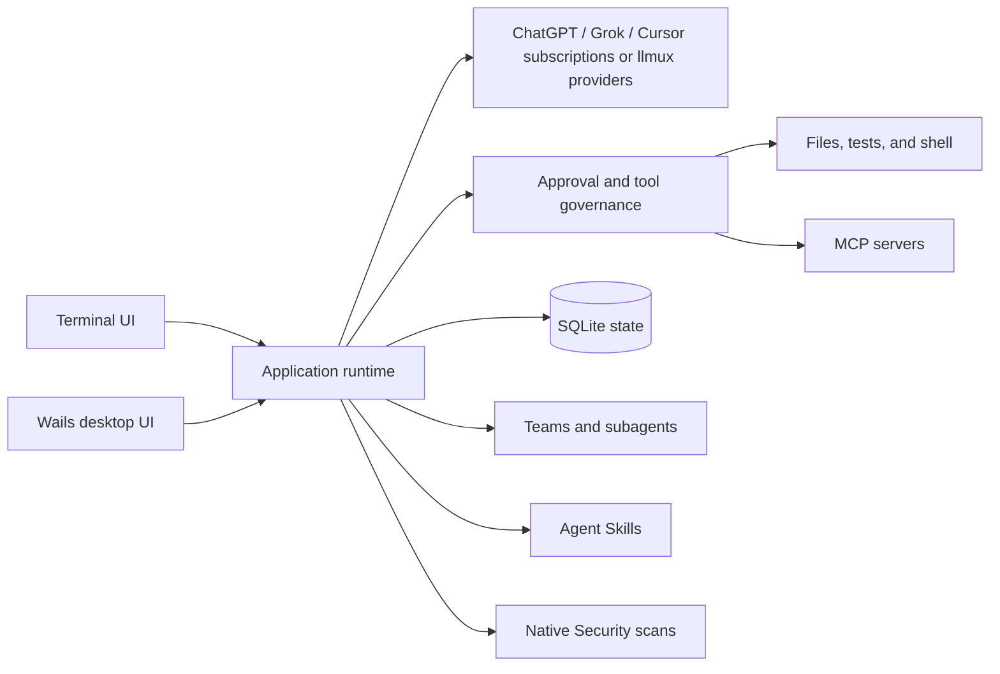

<div align="center">

# Azem

**A local-first AI coding agent for your terminal and desktop.**

Governed tools, durable session trees, extensible runtimes, collaboration, protocol servers, and multi-agent workflows - from the TUI, desktop, headless CLI, or Go API.

[](https://go.dev/)
[](LICENSE)

</div>

> [!WARNING]
> Azem can read and modify files, run shell commands, and access the network when permitted. Commit or back up important work, and review the [security model](#security-model) before enabling permissive policies.

## Why Azem?

Azem is designed for coding work that needs more than a chat window. It combines model-driven development with explicit approval policies and persistent execution records, so tool calls remain visible, recoverable, and easier to audit.

| Capability | What it provides |
|---|---|
| **Terminal and desktop workflows** | A fast Bubble Tea TUI plus a Wails desktop workspace with frame-paced streaming output, inline approvals and diffs, Agent inspection, recovery, and role-model settings |
| **Governed execution** | Prompt, Auto Review, and YOLO approval modes for file, shell, and external actions |
| **Durable state** | SQLite-backed sessions, runs, approvals, leases, side-effect reconciliation, and Team resume |
| **Multiple providers** | ChatGPT through Codex-compatible OAuth, Grok through API or CLI-proxy transport, Cursor through its native agent service, and configurable llmux providers |
| **Extensible tools** | Codex-compatible plugins, MCP servers over stdio or Streamable HTTP, plus dynamically loaded Agent Skills |
| **Multi-agent work** | Structured team mode and resumable subagents with optional Git worktree isolation |
| **Evidence-bound evaluation** | Deterministic durable trajectory export, revision-compatible verification records, offline route/training evaluation, and validated exact-model adapter experiments without a second live router |
| **OMP v18.0.3 behavioral parity** | Frozen, tested coverage for coding tools, Goal/Advisor/Vibe/TTSR modes, extensions and marketplaces, session trees/import/export/share/collaboration, JSON-RPC, ACP, headless operation, auth brokering, and operator workflows |

## Quick Start

### 1. Build Azem

Requirements:

- Go 1.25.8 or later; the project recommends the Go 1.25.12 toolchain
- A supported ChatGPT or Grok account or existing credential
- Git when using subagent worktree isolation

```bash
git clone https://github.com/Viking602/azem.git
cd azem
make build
```

To build the Wails desktop app, install [Bun](https://bun.sh/) and run:

```bash
make gui
open dist/Azem.app
```

For Windows, build the native executable with:

```powershell
make gui-windows
.\dist\windows-amd64\Azem.exe
```

Windows requires the WebView2 Runtime and uses PowerShell for agent and
background commands. PowerShell 7 (`pwsh.exe`) is preferred when installed;
the built-in Windows PowerShell is the fallback. Bash hooks additionally
require Git Bash.

The desktop app and TUI share the same Go runtime, SQLite sessions, approval policy, model routes, Skills, subagents, and recovery state. The React UI receives a bounded event projection; it does not expose arbitrary shell or filesystem bindings.

Desktop global search (`Cmd+K` on macOS or `Ctrl+K` elsewhere) searches application actions, every settings control and configured model/MCP/Skill/plugin name, session titles, and durable user/assistant conversation content across projects. Settings results open and focus the exact control. Conversation-content results return a short SQLite FTS snippet and jump to the durable matching message; cross-project results open the owning project first. Input is debounced, stale responses are discarded, and complete transcripts are never copied into the frontend search index.

On macOS, Azem follows the active system HTTP, HTTPS, and SOCKS proxy settings
automatically, including the bypass list. This matches the network path used by
Chromium/Electron applications such as Codex when the desktop app is launched
from Finder and has no shell proxy environment. `HTTP_PROXY`, `HTTPS_PROXY`,
and `NO_PROXY` remain explicit per-process overrides on every platform.

Desktop text output is presented in frame-paced chunks. Rendering is capped independently from the display refresh rate, large backlogs catch up automatically, and reduced-motion preferences disable animation without disabling bounded rendering.

Desktop **Settings → Usage** shows a project-scoped token ledger from completed
provider requests: totals, a responsive full-width activity heatmap, main vs
subagent breakdown, and model (and skill, when recorded) counts. Cache stays
unreported for providers that do not report it.

Cursor keeps one isolated conversation/checkpoint cache per logical main,
Team-role, or subagent request stream. Cursor does not return cache-read token
counts, so its cache card settles on **Not reported** rather than treating the
missing field as a zero-percent hit.

Desktop **Settings → Appearance** provides persistent global interface font,
11–20 px chrome font-size, language, and theme controls, plus separate chat
**UI text** (12–20 px, default 13) and **code font size** (11–18 px, default
12) that apply only to the conversation surface. The searchable font picker
reads families installed on the host operating system and uses localized family
names when the font supplies them. macOS uses AppKit, Linux uses fontconfig,
and Windows uses the installed Windows font collection; typography changes
preview immediately without modifying project or runtime configuration.

While a desktop turn is running, the composer supports Codex-style **Queue** and **Steer** delivery. Queue holds ordered, editable follow-ups for the next turn; Steer injects text or image guidance at the next model boundary without cancelling completed tool work. `Cmd+Shift+Enter` on macOS or `Ctrl+Shift+Enter` elsewhere uses the opposite mode for one message. Queues are session-scoped, stay in order, and pause after an interrupted run until explicitly resumed.

If you switch to another conversation while a turn continues, its session row
keeps the running indicator. A successful or failed background completion adds
a blue unread dot, persisted across refreshes; opening that conversation clears
the dot.

The desktop **Pull Requests** workspace uses the authenticated [GitHub CLI](https://cli.github.com/) for the repository at the workspace root. It lists the current and open pull requests, checks, files, comments, reviews, and merge state; supported mutations include editing, review requests, comments, reviews, draft/ready transitions, close/reopen, merge, and auto-merge. Merge requests are pinned to the displayed head commit so a stale panel cannot merge a newer revision.

**Monitor & Fix** polls an enabled pull request for failed checks or merge conflicts and starts at most one active governed Azem repair session for each observed failure fingerprint; an interrupted repair is eligible for retry after restart. Repair starts only when the workspace is clean and checked out to the pull request head branch; it never merges the pull request automatically. Missing `gh`, authentication, repository access, and network failures are reported in the Pull Requests workspace instead of disabling the rest of the desktop app.

### 2. Start it in a project

The desktop app keeps a durable catalog of projects and restores the most recently opened project. `--workspace` selects one project for that window without rewriting the user configuration.

```bash
cd /path/to/your/project
/path/to/azem
```

You can also run it directly from the source tree:

```bash
go run ./cmd/azem
```

### 3. Connect a provider

Sign in from the TUI:

```text
/login chatgpt
/login grok
```

Or import credentials from an existing Codex or Grok installation:

```text
/login chatgpt --import-codex
/login grok --import
```

Azem searches `CODEX_HOME` (or `~/.codex`) for Codex credentials and `~/.grok` for Grok credentials. Grok's OAuth-compatible flow is experimental and is not a stable third-party authentication contract provided specifically for Azem.

### 4. Ask for a change

Enter a request such as:

```text
Inspect this project, fix the failing tests, and explain the changes.
```

Azem streams progress in the terminal and asks for approval when the selected policy requires it.

## Core Features

- File discovery, reading, searching, patch editing, formatting, testing, and shell execution
- Codex-style desktop workspace browser and change-review surface with lazy file trees, bounded tabs, virtualized text viewing, image previews, directory-folded large change sets, and per-file unified diffs loaded on demand
- Embedded desktop terminal in the current project workspace (`Cmd+`` / `Ctrl+``), with tabs and a real PTY; this is a human console, not the agent shell tool
- Streaming model output, reasoning state, tool activity, approval decisions, and usage information
- General interactive `ask` questions plus a separate planning mode with versioned proposals, review and revision turns, and an explicit Execute Plan handoff into a new ordinary implementation turn
- ChatGPT, Grok, and Cursor subscription login with live model catalogs, account identity and plan, provider-specific remaining quota, reset countdowns, credit balance, and Cursor Total/Cursor/Third Party pace forecasts. Cursor's exact tier, Thinking, and Fast IDs collapse into one base-model row; each row reports its available variant inventory. Thinking is selected automatically whenever the family has a matching same-tier variant. Fast is changed inside the model picker and appears outside only as `· Fast` in the selected-model summary for both Cursor and ChatGPT/Codex subscriptions. The provider model catalog is searchable, and a family switch enables or disables every raw variant atomically. Models without a zero-data-retention guarantee show an explicit warning.
- Collapsible, colorized inline diffs with file paths and added/deleted line counts
- Concise tool summaries that avoid flooding the transcript with raw patches or file contents
- Persistent conversations start in a fresh session on every launch; use `/resume` to reopen prior sessions with their context, tool history, and recap
- Durable main-agent timelines use the model's own action update as the visible progress step, keep its related read, search, edit, test, and shell calls expandable underneath, and preserve that history across cancellation and process restarts; observed file hashes let resumed turns reuse unchanged evidence and target only stale paths
- Durable action attempts and reconciliation of unknown side effects after interruption; Team and eligible Single-Agent runs resume automatically without replaying completed side effects
- Retry handling for transient ChatGPT transport failures before output is emitted
- MCP server discovery, reconnect, concurrency controls, and per-tool policies
- Agent Skills discovery from user, project, configured, and bundled directories, with searchable desktop controls that can stop unneeded Skills from loading while keeping them available for later restoration
- Planner, Implementer, Reviewer, and Reporter team workflow
- Background subagents with role, persona, model, budget, resume, and cancellation controls
- Independent tool calls dispatch in parallel while shell and subagent runtimes enforce their configured concurrency limits
- Optional detached Git worktrees for isolated subagent changes
- Native Standard, scoped, diff, working-tree, and Deep security scans using host-resolved Azem provider/model routes, immutable read-only source snapshots, durable worker/reducer recovery, canonical findings/reports/SARIF, triage, isolated verified patches, and governed GitHub/MCP publication
- OMP-compatible read/write/Hashline/AST/LSP/DAP/eval/browser/computer/web/GitHub/SSH/process/media/memory tools, with Python, JavaScript, Ruby, and Julia eval kernels enabled when their host runtimes exist
- Goal, Advisor, Vibe, TTSR, prewalk, checkpoint/rewind, loop guards, structured subagents, Hub peer messaging, and parked-agent revival
- Parent-linked session trees with named branches and labels, Claude/Codex import, HTML/text/lossless JSON export, encrypted sharing, and encrypted live collaboration
- Text and NDJSON headless modes, JSON-RPC, ACP, and the supported Go embedding API
- Marketplace source management, scoped plugin install/update/upgrade/enable/uninstall, custom Bun tools/commands/providers/agents/themes, and permission-only extension file mutation brokerage
- Operator commands for auth broker/gateway services, setup/update/garbage collection, usage reports, benchmarks, signed GitHub webhooks, and bash/zsh/fish completion generation

## Terminal Workflow

Azem keeps review context in the conversation instead of hiding it behind raw tool payloads:

- **Approval cards** show the requested action and target as a separate lifecycle from the tool execution. Auto Review cards move from reviewing to Allowed, Denied, Timed out, or Review failed, and include risk and rationale when available.
- **Inline file diffs** turn successful patch edits and newly created files into collapsible transcript blocks. Each block identifies the affected file, reports `+added/-deleted` totals, and colorizes changed lines.
- **Compact tool activity** summarizes file reads, searches, tests, shell commands, edits, and failures. Large patch bodies and complete file contents stay out of routine status messages.
- **Subagent visibility** applies the same summaries and file-diff presentation when inspecting child-agent activity.
- **Context visibility** shows startup occupancy before the first model call, then calibrates the total from provider usage. The segmented meter and `/context` breakdown separate core instructions, Skills, built-in tools, MCP tools, conversation history, and provider framing.
- **Deterministic context archiving** keeps the three most recent complete user turns verbatim, archives older complete turns as a durable source artifact, and exposes policy, canonical high-water, reason, segments, and archive metadata in the Inspector. `/compact` and `/rebuild` use the same host kernel.

## How It Works


```mermaid
flowchart LR
    U[Terminal UI] --> A[Application runtime]
    D[Wails desktop UI] --> A
    A --> P[ChatGPT / Grok / Cursor subscriptions or llmux providers]
    A --> G[Approval and tool governance]
    G --> T[Files, tests, and shell]
    G --> M[MCP servers]
    A --> S[(SQLite state)]
    A --> C[Teams and subagents]
    A --> K[Agent Skills]
    A --> Q[Native Security scans]
```

Each turn is routed through the application runtime, which selects a provider, assembles the available tools, applies approval policy, persists execution state, and streams events back to the TUI. Structured tool results are projected into readable summaries and file diffs. After a restart, Azem restores durable run projections and surfaces side effects that require reconciliation. Team runs and eligible Single-Agent runs resume automatically; runs requiring side-effect reconciliation remain paused for an explicit decision.

### Provider stream resilience

For ChatGPT, Azem retries transient stream-opening and transport failures up to five times when no response output has been emitted. This includes connection resets, temporary network errors, interrupted streams, and selected TLS transport failures. Cancellation, deadlines, invalid requests, and certificate validation errors are not retried. After any output has been emitted, Azem does not replay the request, avoiding duplicate partial responses or tool activity.

llmux transports disable their internal retry loop and use the same Venat retry
boundary, so Azem has one owner for retry timing and duplicate-output safety.

## Usage

### Command-line options

```text
azem [-config /path/to/config.yaml]
azem --version
```

| Option | Description |
|---|---|
| `-config` | Load a specific YAML configuration file |
| `--version` | Print the version, current Git short hash, and UTC build time |

Without `-config`, Azem reads `~/.azem/config.yaml`. If the file does not exist, built-in defaults are used. `AZEM_HOME` overrides that directory.

### Keyboard shortcuts

| Shortcut | Action |
|---|---|
| `Enter` | Submit input or confirm a selection |
| `Ctrl+J` | Insert a newline |
| `Esc` | Close a dialog or cancel the active run |
| `Ctrl+C` | Cancel the active run, or quit while idle |
| `Ctrl+P` | Open the command palette |
| `Ctrl+M` | Select a model |
| `Ctrl+R` | Select reasoning effort |
| `Ctrl+B` | Inspect subagents |
| `Shift+Tab` | Cycle the approval mode |
| `PageUp` / `PageDown` | Scroll through conversation history |
| `Ctrl+Home` / `Ctrl+End` | Jump to the beginning or end |
| `?` | Open help when the input is empty |

### Slash commands

| Command | Description |
|---|---|
| `/settings` | Configure the plan model, Codex Fast mode, subagent models, concurrency, and interface preferences |
| `/models` | Search for and select a model |
| `/model-routing` | Configure models for titles, plan mode, approvals, vision fallback, recaps, and each subagent role |
| `/provider [chatgpt\|grok]` | Switch providers |
| `/reasoning [level]` | Set reasoning effort |
| `/login [provider]` | Sign in or import provider credentials |
| `/logout [provider]` | Sign out of a provider account |
| `/skills [reload]` | Inspect or reload Agent Skills |
| `/skill <name> [instruction]` | Activate a Skill and run one turn |
| `/team on\|off` | Enable or disable team mode |
| `/plan [on\|off]` | Enable or disable read-only planning mode |
| `/agents [cancel <id>]` | Inspect or cancel subagents |
| `/agent-types` | Inspect available subagent types |
| `/personas` | Inspect subagent personas |
| `/new` | Create a new session |
| `/sessions` | List saved sessions |
| `/resume` | Resume a saved session |
| `/tree` | Show the current parent-linked session tree |
| `/branch <entry-id>` | Move the active session leaf to an existing entry |
| `/fork <target-session-id> [entry-id]` | Fork a session at an entry |
| `/label <entry-id> [label]` | Set or clear a branch entry label |
| `/export <path> [html\|text\|json]` | Export the current session |
| `/share <server-url> [blob\|gist]` | Publish an encrypted session snapshot |
| `/import <claude\|codex> <jsonl-path> <target-session-id>` | Import a foreign transcript |
| `/collab [host\|join\|stop\|status]` | Manage encrypted live collaboration |
| `/usage [all]` | Show the token usage report |
| `/extensions` | List loaded plugin and extension capabilities |
| `/marketplace ...` | List, discover, add, update, install, upgrade, enable, disable, or uninstall marketplace plugins |
| `/compact` | Archive older context with the deterministic host kernel |
| `/rebuild` | Immediately rebuild context with the same deterministic archive path |
| `/memory [query]` | Search workspace-native memory |
| `/remember <text>` | Save explicit evidence to workspace memory |
| `/forget <memory-id>` | Remove one workspace memory |
| `/recap` | Inspect the current session continuity recap |
| `/mcp [refresh\|reconnect <server>]` | Inspect or update MCP servers |
| `/status` | Inspect runtime, session, cache, and token diagnostics |
| `/context` | Inspect the segmented context-window occupancy and individual contributors |
| `/reconcile <attempt-id> <result>` | Reconcile an unknown side effect |
| `/cancel` | Cancel the active run |
| `/help` | Open help |
| `/quit` | Quit Azem |

### Planning workflow

`ask` is available in ordinary single-agent turns whenever the runtime has an
interactive client. Planning mode additionally constrains the planner to
read-only tools and lets it use `ask` for one to three concrete questions before
publishing a durable proposal with `submit_plan`. You can ask follow-up questions
or request changes without leaving planning mode; every new proposal supersedes
the previous version while preserving the review history. Selecting **Execute
Plan** is the only approval action. Azem then starts a new ordinary turn with
the approved proposal attached as trusted private context and restores the full
implementation tool set. Reopening the session restores unresolved questions
and the latest proposed plan in both the terminal and desktop applications.

## Configuration

Pass a custom configuration file with:

```bash
azem -config ./config.yaml
```

Azem rejects unknown fields, unsupported enum values, malformed durations, and invalid MCP settings. Relative workspace and Skill paths are resolved from the configuration file directory.

```yaml
version: 1

defaults:
  provider: chatgpt
  model: gpt-5.6-sol
  reasoning: high
  agent_mode: single       # single | team
  queue_mode: queue        # queue | guide

workspace:
  root: .
  allow_write: true
  shell_policy: prompt     # prompt | deny | allow
  allow_network: prompt    # prompt | deny | allow
  shell:
    max_context_output_bytes: 65536
    max_artifact_output_bytes: 4194304
    stop_on_output_limit: true
    max_concurrency: 2
    max_wall_clock: 10m      # per-command ceiling; the model may request less via wall_clock_seconds

auth:
  store: keyring           # sqlite | keyring | file
  import_codex: true
  import_grok: true
  broker:
    url: ""                # HTTPS, except loopback HTTP
    token: ""              # prefer AZEM_AUTH_BROKER_TOKEN
    snapshot_cache: ""
    snapshot_ttl: 1h
    account_pool_file: ""

providers:
  chatgpt:
    enabled: true
    catalog_ttl: 5m
    fast_mode: false       # supported subscription models only; faster responses use more credits
    disabled_models: []   # hidden from pickers and rejected by the runtime
  grok:
    enabled: true
    catalog_ttl: 5m
    experimental_oauth: true
    transport: api
  llmux:
    openrouter:
      enabled: true
      # API keys are not written here. Configure one in Desktop Settings or set OPENROUTER_API_KEY.
      base_url: "" # empty uses llmux's provider default
      # Model catalogs live in SQLite (`llmux_provider_models`), not this file.


retry:
  enabled: true
  max_retries: 5          # full-engine retries after transport retries are exhausted
  base_delay: 500ms       # exponential task-retry backoff base
  max_delay: 5m           # maximum task or server-requested retry delay; 0s disables the cap

ttsr:
  enabled: true
  context_mode: discard
  interrupt_mode: always
  repeat_mode: once
  repeat_gap: 10
  rules: []

agents:
  main:
    max_tokens: 0          # optional inter-request limit; the final request may overshoot it
    max_tool_calls: 0      # optional per-turn limit; 0 means unbounded
    max_wall_clock: 0s     # optional per-turn limit; 0s means unbounded
  team:
    max_concurrency: 2
    max_ticks: 12
  title:
    # Lightweight model used for first-turn session titles.
    provider: chatgpt
    model: gpt-5.6-luna
    reasoning: low
  plan:
    # Empty provider/model inherit the active model and reasoning effort.
    provider: ""
    model: ""
    reasoning: ""
  approval:
    # Reviewer for "Approve for me"; any enabled provider/model is supported.
    provider: chatgpt
    model: gpt-5.6-luna
    reasoning: low
  vision:
    # Explicit image-capable helper for text-only main models. Empty disables fallback.
    provider: ""
    model: ""
    reasoning: ""
  recap:
    # Lightweight model used after each successful turn for the right-sidebar recap.
    provider: chatgpt
    model: gpt-5.6-luna
    reasoning: low
  advisor:
    enabled: false
    provider: chatgpt
    model: gpt-5.6-luna
    reasoning: low
    catchup_timeout: 30s
  vibe:
    fast: { provider: chatgpt, model: gpt-5.6-luna, reasoning: low }
    good: {}
  loop_guards:
    thinking_enabled: true
    assistant_text_enabled: true
    tool_call_enabled: true
    tool_call_threshold: 5
    tool_call_exempt_tools: [hub, vibe_wait, subagent.get_output]
    unexpected_stop: mechanical
    unexpected_stop_retries: 2
  context:
    enabled: true
    reserve_tokens: 16384       # minimum headroom; effective reserve is at least 15% of the context window
    keep_recent_tokens: 20000   # preferred hot-tail floor; latest 3 user turns are always preserved
    large_tool_result_tokens: 12000
    history_retrieval_tokens: 4096 # private, session-scoped SQLite FTS evidence budget
  subagents:
    enabled: true
    max_depth: 2             # nested delegation levels; -1 is unlimited, 0 disables delegation
    max_concurrency: 32      # running subagents; 0 is unlimited
    await_timeout: 0s        # 0s waits until the foreground child completes; a positive duration only releases the parent
    idle_timeout: 5m         # default 5m; 0s disables; cancels a silent running child with no thinking, output, or tool activity
    auto_wake: true
    routes:
      explore:
        # Remove this entry to inherit the parent agent's model route.
        provider: grok
        model: grok-4.5
        reasoning: low
    budget:
      soft_requests: 200    # one advisory wrap-up reminder; never cancels the run
      soft_request_notice: true
      max_tokens: 0          # optional inter-request limit; the final request may overshoot it
      max_tool_calls: 0      # optional; 0 means unbounded
      max_turns: 0           # optional; 0 means unbounded
      max_wall_clock: 0s     # optional; 0s means unbounded
security:
  enabled: true
  default_mode: standard
  workers: 4
  subagents: 3
  stop_after_no_new: 4
  stop_after_consecutive_errors: 3
  max_discovery_runs: 40
  max_time_hours: 96     # persisted deadline; native scans have no token/tool hard ceiling
  max_cost_usd: 0       # reserved for trusted provider pricing; must remain zero
  publication_tool: ""   # exact MCP tool; publication stays disabled while empty
  publication_destination: ""
  publication_arguments: {}
  publication_title_field: title
  publication_description_field: description
  routes:
    audit: { provider: "", model: "", reasoning: "" }
    reducer: { provider: "", model: "", reasoning: "" }
    fixer: { provider: "", model: "", reasoning: "" }
    verifier: { provider: "", model: "", reasoning: "" }


skills:
  enabled: true
  trust_project: false       # explicitly enable only for repositories you trust
  additional_dirs: []
  eager: []
  disabled: []

plugins:
  enabled: true
  import_codex: true         # list available Codex plugins for explicit selection
  codex_imports: []          # exact plugin IDs selected for copying into Azem
  trust_hooks: false         # installation is not execution trust; opt in explicitly
  marketplace_auto_update: notify # off | notify | auto

extensions:
  enabled: true
  trust_project_code: false
  additional_tool_paths: []
  additional_command_dirs: []
  additional_extension_paths: []
  additional_agent_dirs: []
  additional_theme_dirs: []

autolearn:
  enabled: false
  auto_continue: false
  min_tool_calls: 5

discovery:
  context_files: true
  rules: true
  skills: true
  mcp: true
  hooks: true
  disabled_providers: []
  disabled_rules: []
  additional_context_files: []

hooks:
  enabled: true
  disabled: []               # per-hook deny list; plugin hooks still require trust_hooks

mcp:
  servers: {}
```

The desktop **Settings → Extensions** page manages `skills.disabled` and
`hooks.disabled` directly. Stopping a Skill removes it from model context,
slash suggestions, eager activation, and the runtime registry. It remains in
the catalog so it can be restored later. If an eager Skill is stopped, Azem
removes it from `eager`; restoring it returns it in on-demand mode. Each Hook
row can be enabled or stopped without changing the global plugin-hook trust
decision. An untrusted plugin hook that is marked enabled still does not run.

The same Extensions page projects the real MCP manager rather than inferring
servers from installed plugins. It lists local and remote servers, live
connection state, imported tool count, and approval mode. Servers can be
enabled, disabled, refreshed, reconnected, or added from the desktop; every
change is validated, written to `mcp.servers`, and applied to the live manager
without restarting Azem. New connections start in the background so Settings
does not freeze while a process or network service comes online.

### Approval modes

Use `Shift+Tab` to cycle between modes:

| Mode | Behavior |
|---|---|
| **Prompt** | Ask the user before governed actions |
| **Auto Review** | Ask the model configured by `agents.approval` to assess actions and show its decision, risk, and rationale in the transcript |
| **YOLO** | Approve actions automatically; use only in trusted environments |

The configured tool effect and approval policy still determine which operations enter the approval flow. Approval cards remain separate from subsequent tool and diff blocks, so a review decision is not mistaken for completed execution.

## MCP Integrations

The desktop app loads plugins only from Azem's own `plugin-packages` data
directory. Install a plugin directly under `plugin-packages/local/<plugin>`, or
use **Settings → Extensions → Plugins** to select individual entries discovered
from Codex. Only selected IDs are copied into
`plugin-packages/codex/<marketplace>/<plugin>`. Imported packages remain
available from the Azem-owned copy and are never executed directly from a
Codex source or cache directory. A valid plugin has
`.codex-plugin/plugin.json`; its declared Skills and eligible MCP servers are
attached to the Azem runtime at startup. Plugin hooks remain disabled unless
`plugins.trust_hooks` is enabled, and `.app.json` connections are shown as
requiring separate authorization. See
[Plugin compatibility](docs/plugins.md) for the supported standard and security
boundaries.

Azem includes the read-only [grep.app](https://grep.app) MCP server by default, exposed as `mcp__grep__searchGitHub`. It searches public GitHub repositories for literal code patterns. Override or disable it through `mcp.servers.grep` in the configuration file.

Azem also supports custom local stdio servers and remote Streamable HTTP servers.
Use **Settings → Extensions → MCP services → Add MCP service** to create one,
or edit the equivalent YAML below. The desktop form accepts only `env:NAME` or
`keyring:NAME` secret references; it never stores or projects plaintext values.
Every service can also be deleted from this page. Deletion stops the live
connection, atomically removes its definition, and records a tombstone in
`mcp.removed_servers` so built-in or plugin catalogs cannot recreate it.

### stdio

```yaml
mcp:
  servers:
    local_tools:
      enabled: true
      transport: stdio
      command: /path/to/mcp-server
      args: []
      inherit_env: true
      connect_timeout: 30s
      call_timeout: 60s
      max_concurrency: 2
      approval: always
```

### Streamable HTTP

```yaml
mcp:
  servers:
    remote_tools:
      enabled: true
      transport: streamable_http
      url: https://example.com/mcp
      headers:
        Authorization: env:MCP_AUTHORIZATION
      connect_timeout: 30s
      call_timeout: 60s
      max_concurrency: 2
      approval: always
```

Secrets must be references rather than literal values:

- `env:NAME` reads an environment variable.
- `keyring:NAME` reads an entry from the system keyring.

Remote MCP URLs must use HTTPS. Plain HTTP is accepted only for localhost or loopback addresses.

## Data and Credentials

Azem keeps configuration, the database, plugins, blobs, and runtime state in
one home directory:

| Data | Location |
|---|---|
| Home | `~/.azem`, or `$AZEM_HOME` |
| Configuration | `config.yaml` in that home |
| Database | `azem.db` in that home |
| Large payloads | `blobs/` in that home |
| Plugin packages | `plugin-packages/` in that home |
| Runtime state | `azem.log`, window state, and hook transcripts in that home |
| Security scans | `security-scans/` in that home |

Existing files in `~/.config/azem`, the platform Application Support or
`~/.local/share/azem` data directory, and the platform cache directory are
moved into `~/.azem` on the first launch that uses the default home. Quit
every Azem process before that migration. `AZEM_HOME` skips it.

Credentials can be stored in SQLite, the system keyring, or a permission-restricted JSON file. SQLite and file storage rely on filesystem permissions and do not provide application-level encryption at rest. Use the system keyring when stronger local credential protection is required.

Desktop **Settings → Model settings** stores llmux API keys through that same
credential service. Keys are write-only from the UI: runtime events expose only
whether a stored key or environment variable is available. Once enabled, a
provider can fetch its authenticated model list and display the exact
models.dev context limits, modalities, capabilities, and reasoning levels
before storing the catalog in SQLite. Subscription and llmux catalogs resolve provider
slugs and aliases through models.dev, so model pickers show friendly names
while requests still use the provider's actual model ID. Cursor may publish one
raw ID for every reasoning, Thinking, and Fast combination; Model settings
groups only IDs with a recognized shared base and lets the user switch the
variant inside that card. The availability switch still targets that exact raw
ID. Disabled variants remain manageable in Settings but disappear from model
and role-route selectors and are rejected by the runtime.

## Security Model

Azem's approvals and persistent action boundaries help reduce accidental operations and duplicate side effects. They are governance controls, not an operating-system sandbox.

- In the TUI, `workspace.root` sets the initial shell directory. Desktop windows
  use the selected project from the SQLite catalog instead. Neither mode is an
  OS sandbox: shell commands can still access paths outside the project.
- `allow_write: false` removes built-in write tools but cannot stop an approved shell command from writing files.
- `allow_network` relies on tools declaring network use and does not enforce OS-level network isolation.
- `shell_policy: allow` and YOLO mode remove important confirmation points.
- A subagent that explicitly requests worktree isolation fails if the worktree cannot be created; it never falls back to the shared workspace.
- A trusted custom extension may register file write/delete fallbacks. Azem
  consults them only after an ordinary workspace-local file mutation fails with
  `EACCES`, `EPERM`, or `EROFS`; non-permission failures, archive/SQLite writes,
  unresolved symlinks, and paths outside the workspace never reach the broker.
- Auth broker and gateway bearer tokens grant access to credential projections.
  Use HTTPS except on loopback, keep tokens out of YAML when environment or
  permission-restricted token files are available, and expose neither service
  on an untrusted network.

For strict isolation, run Azem inside a container, virtual machine, or restricted OS account, and enforce filesystem and network policy outside the application.

## Project Layout

```text
cmd/azem/               Terminal application entry point
cmd/azem-gui/           Wails desktop application entry point
frontend/               React desktop interface and Wails bindings
internal/agent/         Tool governance, persistent runs, and team agents
internal/app/           Application orchestration, providers, and subagents
internal/auth/          OAuth, credential import, and credential storage
internal/config/        Configuration, paths, roles, and personas
internal/desktop/       Bounded Wails bridge and desktop lifecycle
internal/desktop/termhost/ Human-only PTY host for the embedded desktop terminal
internal/githubpr/      GitHub CLI projection, mutations, and PR monitor
internal/authbroker/    Multi-process credential snapshots, refresh, account pools, and usage
internal/authgateway/   Protocol-compatible provider forwarding gateway
internal/collab/        Encrypted host/guest live collaboration relay
internal/customtools/   Isolated Bun tools, commands, providers, agents, themes, and file broker
internal/parity/        Frozen OMP v18.0.3 capability manifest
internal/rpc/           JSON-RPC v1/v2 server
internal/acp/           Agent Client Protocol server
internal/sessionimport/ Claude and Codex JSONL importers
internal/sessionexport/ HTML, text, and lossless JSON exporters
internal/sessionshare/  Encrypted blob/gist session sharing
internal/mcp/           MCP connection and tool management
internal/provider/      ChatGPT/Codex, Grok, Cursor, llmux drivers, and model catalogs
internal/recovery/      Crash recovery and side-effect reconciliation
internal/blobstore/     Content-addressed files for large payloads
internal/session/       Session persistence and compaction
internal/skills/        Agent Skills discovery and activation
internal/securityscan/  Native scan snapshots, orchestration, findings, remediation, contracts, and exports
internal/store/sqlite/  SQLite schema and storage implementation
internal/tui/           Bubble Tea terminal interface
docs/                   Maintainer architecture, persistence, and testing guides
.sentrux/               Executable architecture constraints
```

Maintainer documentation:

- [Architecture](docs/architecture.md)
- [Desktop application and workspace browser](docs/desktop.md)
- [Persistence and recovery](docs/persistence.md)
- [Testing and desktop smoke checks](docs/testing.md)
- [Native security scanning](docs/security-scanning.md)

## Development

Run the complete Go suite against declared module dependencies:

```bash
GOWORK=off go test ./...
```

Run frontend and desktop checks:

```bash
make test-gui
```

Run the architecture policy gate:

```bash
make architecture-check
```

Format changed Go files before committing. See [Testing](docs/testing.md) for
the change-specific verification matrix and real GUI smoke procedure.

```bash
gofmt -w path/to/file.go
```

Live provider acceptance tests use the `live` build tag and require valid credentials plus an explicit environment switch. The standard test suite does not access real accounts.

## License

Azem is available under the [MIT License](LICENSE).
