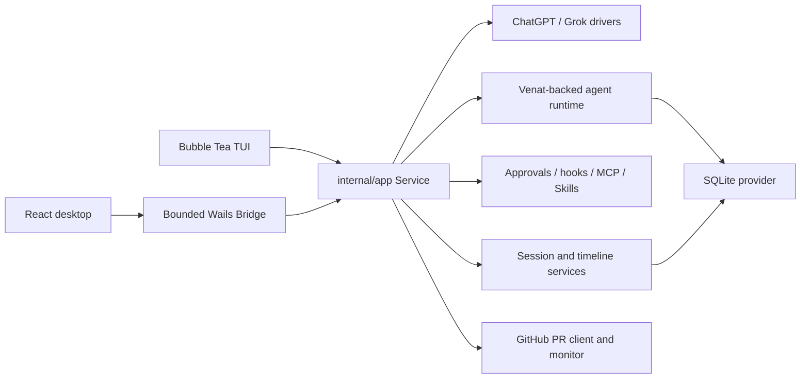

# Architecture

Last verified: 2026-08-06

Azem is a local-first coding agent with two user interfaces over one Go
runtime. The terminal and desktop applications share configuration, agent
execution, provider routing, approvals, durable state, Skills, MCP servers,
subagents, and recovery. The UI layers project that runtime; they do not own a
second execution engine.

## Runtime overview



## Startup and composition

`cmd/azem/main.go` starts the Bubble Tea application. `cmd/azem-gui/main.go`
starts Wails, embeds the built React application, and registers the desktop
Bridge. Both paths call the composition root in `internal/app/bootstrap.go`.

Bootstrap has four ordered stages:

1. `loadConfiguration` resolves the startup path and operating-system paths,
   loads strict configuration, and creates protected data directories.
2. `buildCore` opens SQLite. Desktop bootstrap restores the most recently
   opened valid project unless `--workspace` selected one explicitly; terminal
   bootstrap keeps its process working directory. It then loads Skills,
   constructs session and agent services, selects credential stores, and
   builds provider routing.
3. `wireService` attaches hooks, MCP, memory, recovery, background processes,
   and provider execution to one `app.Service`.
4. `start` performs crash recovery, starts supporting services, and emits the
   initial runtime projection.

If construction fails, bootstrap closes every component it already opened.
Do not bypass this composition root with package globals or a second desktop
runtime.

## Package boundaries

| Package | Responsibility | Must not own |
|---|---|---|
| `cmd/azem` | CLI flags, signals, TUI startup and shutdown | Agent or persistence behavior |
| `cmd/azem-gui` | Wails lifecycle, windows, deep links, desktop startup | Arbitrary filesystem or shell APIs |
| `frontend/src` | React projection, interaction state, typed Bridge calls | Provider execution or authoritative durable state |
| `internal/desktop` | Closed Bridge operation set and event forwarding | General-purpose shell or filesystem access |
| `internal/tui` | Bubble Tea state, rendering, input routing | Duplicate runtime services |
| `internal/app` | Composition and orchestration of turns, events, providers, approvals, subagents, and recovery | Provider-specific wire parsing or raw SQL |
| `internal/agent` | Governed tools, Venat runs, teams, scheduling, worktrees | UI rendering |
| `internal/provider` | Provider transports, request/stream normalization, model catalog | Product-level session state |
| `internal/session` | Sessions, projections, timeline records, attachments, usage | Schema migrations |
| `internal/store/sqlite` | Runtime migrations, SQLC adapters, Venat store contracts | UI or provider transport behavior |
| `internal/githubpr` | Safe `git`/`gh` argv execution, PR projection, mutations, monitor state | Shell command composition from user text |

Dependencies flow from entry points and presentation into orchestration, then
into focused runtime and storage packages. Cycles are forbidden by
`.sentrux/rules.toml`.

## Turn and event flow

```text
TUI command or desktop TurnRequest
  -> app.Service validates session, mode, Skills, and active-run state
  -> ProviderRuntime resolves provider/model and builds the Venat engine
  -> approval policy governs file, shell, MCP, and external actions
  -> durable run, action attempts, tool records, and projections are persisted
  -> eventBroker emits ordered runtime events
  -> TUI update loop or desktop Bridge receives the projection
  -> React store reducer updates timeline, approvals, Todos, and subagents
```

The desktop Bridge exposes named methods and a bounded runtime projection. Add
a Bridge method only when a desktop feature needs a real application operation;
never expose an arbitrary command runner to avoid adding a backend endpoint.

## Desktop project ownership

The GUI is project-catalog driven, not process-working-directory driven:

```text
desktop_projects
  -> session_workspaces
  -> session list event
  -> React project tree
  -> active project runtime (branch, PR, tools)
```

Each desktop window owns one workspace-scoped runtime because tools, Skills,
hooks, Git state, and PR operations require an unambiguous root. The sidebar
may show every persisted project; opening a session owned by another project
launches that workspace and session together. Project history lives in SQLite
and must not be serialized as one `workspace.root` setting.

## Provider text phases

Provider frames are normalized before application events are emitted. The
`TextPhase` value must survive this complete path:

```text
provider stream -> app event -> session/desktop projection -> frontend store -> timeline
```

`commentary` surrounds work and tool calls, `reasoning` remains a distinct
thinking projection, and `final_answer` terminates the user-visible response.
Persistence and session reopen must retain phase and order.

The desktop bridge may deliver coalesced text bursts. React keeps those events
ordered, presents text in adaptive chunks at no more than about 30 updates per
second, and accelerates when a terminal event or large backlog is waiting.
Partial chunks do not advance the durable event sequence until the original
event is fully presented. Transcript following uses immediate scrolling while
a run is active so repeated smooth-scroll animations cannot compete with text
rendering. Visual activity indicators use only opacity and transforms and are
disabled by `prefers-reduced-motion`.

## Tool lifecycle and side effects

Tool state is authoritative in the backend:

```text
queued -> awaiting_approval -> running -> completed | failed
```

File changes appear only after execution produces evidence. Non-idempotent
actions are recorded as durable action attempts. At startup, incomplete action
attempts become `unknown` and require reconciliation; successfully recorded
attempts provide the anti-replay ledger used during resumed execution.

GitHub mutations stay inside `internal/githubpr.Client`, which executes `git`
and `gh` with argv, validates input, and pins merge-like operations to the
displayed head OID. The monitor may start an isolated repair session but never
merges automatically.

## Durable runtime relationship

Venat owns run, task, lease, admission, retry, and resource-claim contracts.
Azem supplies SQLite store adapters, provider/tool bindings, UI projections,
and product policy. Do not duplicate framework recovery or scheduling behavior
inside presentation packages. Release verification uses `GOWORK=off` so the
declared module version, not an adjacent checkout, defines behavior.

## Extension points

- **Providers:** implement transport and stream normalization under
  `internal/provider`, then register routing in `internal/app`.
- **MCP:** configure stdio or Streamable HTTP servers through `internal/mcp`;
  keep secrets as environment or keyring references.
- **Skills:** add user, project, configured, or bundled Skill directories;
  activation must flow through the existing `activeSkills` request field.
- **Hooks:** discover supported hook sources through `internal/hooks`; preserve
  timeout and failure policy.
- **Subagents:** extend declared profiles and prompts rather than creating a
  second scheduler.
- **Desktop:** add the smallest typed Bridge method and project its result
  through the existing store/event path.

## Architecture checks

Run:

```bash
make architecture-check
```

The policy rejects dependency cycles, coupling worse than grade B, and God
Files that depend on too many modules. A stable Sentrux quality signal does not
replace compilation or behavioral tests; it only protects structure.
