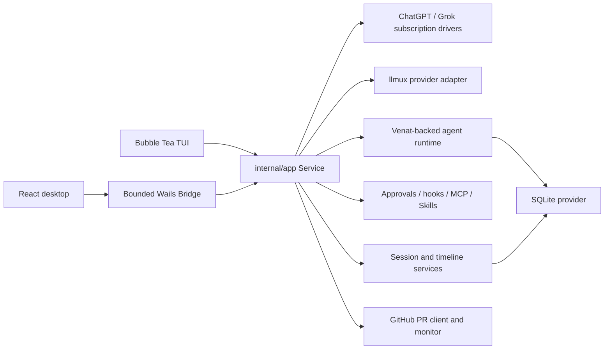

# Architecture

Last verified: 2026-08-08

Azem is a local-first coding agent with two user interfaces over one Go
runtime. The terminal and desktop applications share configuration, agent
execution, provider routing, approvals, durable state, Skills, MCP servers,
subagents, and recovery. The UI layers project that runtime; they do not own a
second execution engine.

## Runtime overview



## Startup and composition

`cmd/azem/main.go` starts the Bubble Tea application. `cmd/azem-gui/main.go`
starts Wails, embeds the built React application, and registers the desktop
Bridge. Both paths call the composition root in `internal/app/bootstrap.go`.

Bootstrap has four ordered stages:

1. `loadConfiguration` resolves the startup path and operating-system paths,
   loads strict configuration, and creates protected data directories.
2. `buildCore` opens SQLite. Desktop bootstrap restores the most recently
   opened valid project unless `--workspace` selected one explicitly; terminal
   bootstrap keeps its process working directory. It then loads Skills,
   constructs session and agent services, selects credential stores, and
   builds provider routing.
3. `wireService` attaches hooks, MCP, memory, recovery, background processes,
   and provider execution to one `app.Service`.
4. `start` performs crash recovery, starts supporting services, and emits the
   initial runtime projection.

If construction fails, bootstrap closes every component it already opened.
Do not bypass this composition root with package globals or a second desktop
runtime.

## Package boundaries

| Package | Responsibility | Must not own |
|---|---|---|
| `cmd/azem` | CLI flags, signals, TUI startup and shutdown | Agent or persistence behavior |
| `cmd/azem-gui` | Wails lifecycle, windows, deep links, desktop startup | Arbitrary filesystem or shell APIs |
| `frontend/src` | React projection, interaction state, typed Bridge calls | Provider execution or authoritative durable state |
| `internal/desktop` | Closed Bridge operation set and event forwarding | General-purpose shell or filesystem access |
| `internal/tui` | Bubble Tea state, rendering, input routing | Duplicate runtime services |
| `internal/app` | Composition and orchestration of turns, events, providers, approvals, subagents, and recovery | Provider-specific wire parsing or raw SQL |
| `internal/agent` | Governed tools, Venat runs, teams, scheduling, worktrees | UI rendering |
| `internal/provider` | Provider transports, request/stream normalization, model catalog | Product-level session state |
| `internal/session` | Sessions, projections, timeline records, attachments, usage | Schema migrations |
| `internal/store/sqlite` | Runtime migrations, SQLC adapters, Venat store contracts | UI or provider transport behavior |
| `internal/githubpr` | Safe `git`/`gh` argv execution, PR projection, mutations, monitor state | Shell command composition from user text |

Dependencies flow from entry points and presentation into orchestration, then
into focused runtime and storage packages. Cycles are forbidden by
`.sentrux/rules.toml`.

## Turn and event flow

```text
TUI command or desktop TurnRequest
  -> app.Service validates session, mode, Skills, and active-run state
  -> ProviderRuntime resolves provider/model and builds the Venat engine
  -> known text-only main model + images invokes agents.vision and substitutes private textual evidence
  -> approval policy governs file, shell, MCP, and external actions
  -> durable run, action attempts, tool records, and projections are persisted
  -> eventBroker emits ordered runtime events
  -> TUI update loop or desktop Bridge receives the projection
  -> React store reducer updates timeline, approvals, Todos, and subagents
```

The desktop Bridge exposes named methods and a bounded runtime projection. Add
a Bridge method only when a desktop feature needs a real application operation;
never expose an arbitrary command runner or general filesystem API. The
workspace browser and workspace change review are deliberate read-only
exceptions with relative-path, resolved-symlink, entry-count, file-size,
Git-output, timeout, and binary-content enforcement in
`internal/desktop/workspace_files.go` and
`internal/desktop/workspace_changes.go`; React cannot weaken those boundaries.

## Planning lifecycle

Planning uses the same session, block, event, provider, and recovery services as
ordinary turns. It is a mode of the shared runtime, not a second agent engine:

```text
plan turn (read-only tools + ask + submit_plan)
  -> question block (pending -> answered)
  -> plan_v1 context artifact + plan block (proposed)
  -> follow-up or revision plan turn (supersedes prior proposal)
  -> explicit Execute Plan action (approved)
  -> new ordinary turn with trusted approved-plan context
```

`ask` persists its question before waiting, so the GUI and TUI can resolve it
through the same typed action and a restarted process can continue from the
durable block. `submit_plan` is terminal for the planning turn and stores the
full proposal as a context artifact; timeline blocks contain the review
projection and version relationship. Asking about or revising a proposal keeps
planning mode active. Approval never resumes the read-only planner in place: it
starts a fresh ordinary turn, restores the configured implementation tools, and
injects only the approved artifact through a private runtime field. Recovery
persists that artifact ID in the run manifest.

The approved artifact also carries an execution-scheduling contract. For a
non-trivial plan, the parent agent remains the orchestrator and integration
owner, computes the dependency-ready task frontier, and dispatches independent
tasks to suitable subagents in one parallel tool batch. Plan tasks declare
dependencies, exclusive file or symbol ownership, acceptance criteria, and
expected evidence so concurrent writers never share a hotspot. Shared
integration work stays parent-owned, and small linear changes avoid delegation
overhead. This policy uses the existing parallel Venat tool mode and the live
subagent catalog; it does not create a separate planner executor.

Delegated completion is never authoritative by itself. The parent tracks each
task through running and terminal states, requires the requested artifacts and
evidence, and diagnoses failed, cancelled, or stalled work before retrying or
reassigning it. Review preferably comes from a different subagent than the
author, but its verdict remains evidence: the parent still inspects the actual
diff and files and directly observes the required verification before advancing
dependent work or accepting the final result.

## Desktop project ownership

The GUI is project-catalog driven, not process-working-directory driven:

```text
desktop_projects
  -> session_workspaces
  -> session list event
  -> React project tree
  -> active project runtime (branch, PR, tools)
```

Each desktop window owns one workspace-scoped runtime because tools, Skills,
hooks, Git state, and PR operations require an unambiguous root. The sidebar
may show every persisted project; opening a session owned by another project
launches that workspace and session together. Project history lives in SQLite
and must not be serialized as one `workspace.root` setting.

## Provider text phases

Provider frames are normalized before application events are emitted. The
`TextPhase` value must survive this complete path:

```text
provider stream -> app event -> session/desktop projection -> frontend store -> timeline
```

`commentary` surrounds work and tool calls, `reasoning` remains a distinct
thinking projection, and `final_answer` terminates the user-visible response.
Persistence and session reopen must retain phase and order.
For providers without a native text phase, streamed text stays provisional
until a tool call classifies it as commentary or a natural stop confirms it as
the final answer.

The desktop bridge may deliver coalesced text bursts. React keeps those events
ordered, presents text in adaptive chunks at no more than about 30 updates per
second, and accelerates when a terminal event or large backlog is waiting.
Partial chunks do not advance the durable event sequence until the original
event is fully presented. Transcript following uses immediate scrolling while
a run is active so repeated smooth-scroll animations cannot compete with text
rendering. Visual activity indicators use only opacity and transforms and are
disabled by `prefers-reduced-motion`.

The event broker coalesces replaceable text, reasoning, and tool-progress
projections by stream identity even when independent streams interleave. If the
bounded projection queue reaches its high-water mark, it discards only those
replaceable events and emits `projection_resync`; it never turns renderer speed
into a provider execution error. Desktop and TUI consumers reload the durable
session projection through `refresh_session`, and a degraded run emits another
resync after its terminal event so the completed transcript is authoritative.
Approvals, tool lifecycle transitions, and run terminal events remain ordered
and lossless.

Active assistant and commentary blocks render as inexpensive pre-wrapped text.
Completed blocks switch to full Markdown, and settled timeline rows use native
`content-visibility` containment so offscreen history does not participate in
every streamed frame.

Subagent transcripts retain their durable source, but the desktop projection
bounds each tool block and hydrates a selected child once; subsequent live
events append deltas instead of polling and retransmitting the full transcript.
Collapsed tool details do not parse or mount terminal output until the user
opens them. Agent tool results are also bounded before Venat checkpoints, which
prevents broad searches and generated-file matches from multiplying into an
oversized execution snapshot.

## Tool lifecycle and side effects

Tool state is authoritative in the backend:

```text
queued -> awaiting_approval -> running -> completed | failed
```

File changes appear only after execution produces evidence. Non-idempotent
actions are recorded as durable action attempts. At startup, incomplete action
attempts become `unknown` and require reconciliation; successfully recorded
attempts provide the anti-replay ledger used during resumed execution.

GitHub mutations stay inside `internal/githubpr.Client`, which executes `git`
and `gh` with argv, validates input, and pins merge-like operations to the
displayed head OID. The monitor may start an isolated repair session but never
merges automatically.

## Durable runtime relationship

Venat owns run, task, lease, admission, retry, and resource-claim contracts.
Azem supplies SQLite store adapters, provider/tool bindings, UI projections,
and product policy. Do not duplicate framework recovery or scheduling behavior
inside presentation packages. Release verification uses `GOWORK=off` so the
declared module version, not an adjacent checkout, defines behavior.

## Extension points

- **Providers:** implement transport and stream normalization under
  `internal/provider`, then register routing in `internal/app`. Generic API-key
  providers use `internal/provider/llmux`; the ChatGPT and Grok IDs remain
  reserved for their subscription drivers.
- **MCP:** configure stdio or Streamable HTTP servers through `internal/mcp`;
  keep secrets as environment or keyring references.
- **Plugins:** `internal/plugins` scans Azem-owned packages, copies optional
  Codex imports into that package directory through a staged replacement, then
  validates manifests and projects plugin Skills, MCP descriptors, hook
  sources, and App requirements into existing runtime boundaries. Runtime
  capability paths never point at Codex storage, and this layer does not create
  a second Skill, MCP, or hook implementation.
- **Skills:** add user, project, configured, or bundled Skill directories;
  activation must flow through the existing `activeSkills` request field.
- **Hooks:** discover supported hook sources through `internal/hooks`; preserve
  timeout and failure policy.
- **Subagents:** extend declared profiles and prompts rather than creating a
  second scheduler.
- **Desktop:** add the smallest typed Bridge method and project its result
  through the existing store/event path.

## Architecture checks

Run:

```bash
make architecture-check
```

The policy rejects dependency cycles, coupling worse than grade B, and God
Files that depend on too many modules. A stable Sentrux quality signal does not
replace compilation or behavioral tests; it only protects structure.
