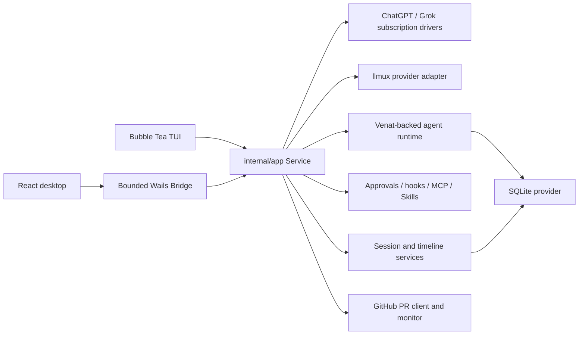

# Architecture

Last verified: 2026-08-24

Azem is a local-first coding agent with two user interfaces over one Go
runtime. The terminal and desktop applications share configuration, agent
execution, provider routing, approvals, durable state, Skills, MCP servers,
subagents, and recovery. The UI layers project that runtime; they do not own a
second execution engine.

## Runtime overview



## Startup and composition

`cmd/azem/main.go` starts the Bubble Tea application. `cmd/azem-gui/main.go`
starts Wails, embeds the built React application, and registers the desktop
Bridge. Both paths call the composition root in `internal/app/bootstrap.go`.

Bootstrap has four ordered stages:

1. `loadConfiguration` resolves the startup path and operating-system paths,
   loads strict configuration, and creates protected data directories.
2. `buildCore` opens SQLite. Desktop bootstrap restores the most recently
   opened valid project unless `--workspace` selected one explicitly; terminal
   bootstrap keeps its process working directory. It then loads Skills,
   constructs session and agent services, selects credential stores, and
   builds provider routing.
3. `wireService` attaches hooks, MCP, memory, recovery, background processes,
   and provider execution to one `app.Service`.
4. `start` performs crash recovery, starts supporting services, and emits the
   initial runtime projection.

If construction fails, bootstrap closes every component it already opened.
Do not bypass this composition root with package globals or a second desktop
runtime.

## Package boundaries

| Package | Responsibility | Must not own |
|---|---|---|
| `cmd/azem` | CLI flags, signals, TUI startup and shutdown | Agent or persistence behavior |
| `cmd/azem-gui` | Wails lifecycle, windows, deep links, desktop startup | Arbitrary filesystem or shell APIs |
| `frontend/src` | React projection, interaction state, typed Bridge calls | Provider execution or authoritative durable state |
| `internal/desktop` | Closed Bridge operation set and event forwarding | Agent shell execution or a generic `sh -c` API |
| `internal/desktop/termhost` | Human-only PTY sessions for the desktop window | Venat tools, approvals, or model-driven stdin |
| `internal/tui` | Bubble Tea state, rendering, input routing | Duplicate runtime services |
| `internal/app` | Composition and orchestration of turns, events, providers, approvals, subagents, and recovery | Provider-specific wire parsing or raw SQL |
| `internal/agent` | Governed tools, Venat runs, teams, scheduling, worktrees | UI rendering |
| `internal/provider` | Provider transports, request/stream normalization, model catalog | Product-level session state |
| `internal/session` | Sessions, projections, timeline records, attachments, usage, blob hydration | Schema migrations |
| `internal/blobstore` | Content-addressed SHA-256 files for large payloads | Session catalog or Venat control plane |
| `internal/store/sqlite` | Runtime migrations, SQLC adapters, Venat store contracts, blob-store open | UI or provider transport behavior |
| `internal/workrevision` | Revision-bound intents, observations, guidance, dispositions, and verification records | UI status as an independent source of truth |
| `internal/securityscan` | Native security targets, immutable snapshots, durable Standard/Deep coordination, findings, remediation, contracts, and exports | Provider transport parsing, foreground session ownership, or UI rendering |
| `internal/evidence` / `internal/codingmemory` | Structural retrieval lineage and opt-in typed memory | Provider routing or automatic promotion |
| `internal/eval` / `internal/routeeval` / `internal/training` | Offline trajectory, replay, calibration, synthesis, and release evaluation | Live admission or mutation authority |
| `internal/toollab` | Non-installable generated-tool sandbox and human promotion records | Production tool registration |
| `internal/adapterdeployment` | Exact validated adapter substitution, rollback, and kill state | A second provider router |
| `internal/githubpr` | Safe `git`/`gh` argv execution, PR projection, mutations, monitor state | Shell command composition from user text |

Dependencies flow from entry points and presentation into orchestration, then
into focused runtime and storage packages. Cycles are forbidden by
`.sentrux/rules.toml`.

## Turn and event flow

```text
TUI command or desktop TurnRequest
  -> app.Service validates session, mode, Skills, and active-run state
  -> ProviderRuntime resolves provider/model and builds the Venat engine
  -> known text-only main model + images invokes agents.vision and substitutes private textual evidence
  -> approval policy governs file, shell, MCP, and external actions
  -> durable run, action attempts, tool records, and projections are persisted
  -> eventBroker emits ordered runtime events
  -> TUI update loop or desktop Bridge receives the projection
  -> React store reducer updates timeline, approvals, Todos, and subagents
  -> subagent evidence status is derived from durable disposition/verification records
  -> the same `agent_state` payload projects that status to TUI and React

```

Work revision, evidence retrieval, memory, route calibration, task synthesis,
adapter comparison, and release evaluation use versioned records. The
`internal/eval`, `internal/routeeval`, and `internal/training` packages are
offline-only: they cannot admit work, execute tools, or alter the live route.
`internal/toollab` runs generated source in pinned, networkless containers and
does not register a tool. A separately approved adapter may be attached through
`internal/adapterdeployment`; it rewrites one exact base model to a validated
model before `ProviderRuntime.resolveDriverForAccount` continues through the
existing account, catalog, and provider checks.

The desktop Bridge exposes named methods and a bounded runtime projection. Add
a Bridge method only when a desktop feature needs a real application operation;
never expose an arbitrary command runner or general filesystem API. The
workspace browser and workspace change review are deliberate read-only
exceptions with relative-path, resolved-symlink, entry-count, file-size,
Git-output, timeout, and binary-content enforcement in
`internal/desktop/workspace_files.go` and
`internal/desktop/workspace_changes.go`; React cannot weaken those boundaries.
The embedded terminal is a second deliberate exception: Go owns the PTY, the
renderer only displays xterm output and forwards keystrokes through named
Bridge methods, and the agent tool catalog cannot write to those sessions.

## Planning lifecycle

Planning uses the same session, block, event, provider, and recovery services as
ordinary turns. It is a mode of the shared runtime, not a second agent engine:

```text
plan turn (read-only tools + ask + submit_plan)
  -> question block (pending -> answered)
  -> plan_v1 context artifact + plan block (proposed)
  -> follow-up or revision plan turn (supersedes prior proposal)
  -> explicit Execute Plan action (approved)
  -> new ordinary turn with trusted approved-plan context
```

`ask` persists its question before waiting, so the GUI and TUI can resolve it
through the same typed action and a restarted process can continue from the
durable block. `submit_plan` is terminal for the planning turn and stores the
full proposal as a context artifact; timeline blocks contain the review
projection and version relationship. Asking about or revising a proposal keeps
planning mode active. Approval never resumes the read-only planner in place: it
starts a fresh ordinary turn, restores the configured implementation tools, and
injects only the approved artifact through a private runtime field. Recovery
persists that artifact ID in the run manifest.

The approved artifact also carries an execution-scheduling contract. For a
non-trivial plan, the parent agent remains the orchestrator and integration
owner, computes the dependency-ready task frontier, and dispatches independent
tasks to suitable subagents in one parallel tool batch. Plan tasks declare
dependencies, exclusive file or symbol ownership, acceptance criteria, and
expected evidence so concurrent writers never share a hotspot. Shared
integration work stays parent-owned, and small linear changes avoid delegation
overhead. This policy uses the existing parallel Venat tool mode and the live
subagent catalog; it does not create a separate planner executor.

Delegated completion is never authoritative by itself. The parent tracks each
task through running and terminal states, requires the requested artifacts and
evidence, and diagnoses failed, cancelled, or stalled work before retrying or
reassigning it. Review preferably comes from a different subagent than the
author, but its verdict remains evidence: the parent still inspects the actual
diff and files and directly observes the required verification before advancing
dependent work or accepting the final result.

## Desktop project ownership

The GUI is project-catalog driven, not process-working-directory driven:

```text
desktop_projects
  -> session_workspaces
  -> session list event
  -> React project tree
  -> active project runtime (branch, PR, tools)
```

Each desktop window owns one workspace-scoped runtime because tools, Skills,
hooks, Git state, and PR operations require an unambiguous root. The sidebar
may show every persisted project; opening a session owned by another project
launches that workspace and session together. Project history lives in SQLite
and must not be serialized as one `workspace.root` setting.

## Provider text phases

Provider frames are normalized before application events are emitted. The
`TextPhase` value must survive this complete path:

```text
provider stream -> app event -> session/desktop projection -> frontend store -> timeline
```

`commentary` surrounds work and tool calls, `reasoning` remains a distinct
thinking projection, and `final_answer` terminates the user-visible response.
Persistence and session reopen must retain phase and order.
For providers without a native text phase, streamed text stays provisional
until a tool call classifies it as commentary or a natural stop confirms it as
the final answer.

The desktop bridge may deliver coalesced text bursts. React keeps those events
ordered, presents text in adaptive chunks at no more than about 30 updates per
second, and accelerates when a terminal event or large backlog is waiting.
Partial chunks do not advance the durable event sequence until the original
event is fully presented. Transcript following uses immediate scrolling while
a run is active so repeated smooth-scroll animations cannot compete with text
rendering. Visual activity indicators use only opacity and transforms and are
disabled by `prefers-reduced-motion`.

The event broker coalesces replaceable text, reasoning, and tool-progress
projections by stream identity even when independent streams interleave. If the
bounded projection queue reaches its high-water mark, it discards only those
replaceable events and emits `projection_resync`; it never turns renderer speed
into a provider execution error. Desktop and TUI consumers reload the durable
session projection through `refresh_session`, and a degraded run emits another
resync after its terminal event so the completed transcript is authoritative.
Approvals, tool lifecycle transitions, and run terminal events remain ordered
and lossless.

Assistant and commentary blocks parse Markdown while they stream. Completing a
live block keeps that tree mounted and drops the caret from the box tree
(`content: none`); history loads use
the memoized Markdown renderer. Settled timeline rows use native
`content-visibility` containment so offscreen history does not participate in
every streamed frame.

Subagent transcripts retain their durable source, but the desktop projection
bounds each tool block and hydrates a selected child once; subsequent live
events append deltas instead of polling and retransmitting the full transcript.
Collapsed tool details do not parse or mount terminal output until the user
opens them. Agent tool results are also bounded before Venat checkpoints, which
prevents broad searches and generated-file matches from multiplying into an
oversized execution snapshot.

Oversized tool results spill instead of discarding bytes: when a governed tool
(including MCP) returns more content or structured output than the 96 KiB
model-side bound, the full payload is durably stored as a session context
artifact (`tool_result_spill`) and the model-visible result keeps a bounded
prefix plus an `artifact:<id>` locator with `context.read_artifact` retrieval
guidance. The shell tool keeps its own earlier artifact spill; if the artifact
write fails the result falls back to the plain lossy truncation, so a storage
problem never fails the tool call. UI previews stay on their separate bounded
projection (UI-002) and are unaffected.

## Archive-first context maintenance

`internal/app` treats long-history maintenance as a durable archive operation,
not an LLM summary transaction. The synchronous path selects a complete-turn
boundary, serializes the omitted messages into `ArchiveSourceV1`, writes a
session-scoped `context_archive` artifact through `internal/session`, and
activates `ArchiveContextManifestV1` plus `ModelHistoryV3` in the existing checkpoint
transaction. The latest three complete user turns remain verbatim.

For a model catalog entry that explicitly supports images,
`internal/contextarchive` renders a bounded set of Silver-font PNG frames and
persists them as generated session attachments. A text-only or unknown model
receives a bounded preview and the same exact artifact reference. Every PNG is
an optimization: restart recovery validates its source SHA and regenerates a
missing frame from the artifact. Repeated compaction expands the old archive
before selecting a new boundary, so the wire history never nests carriers.

The archive trigger is computed directly from catalog capacity:
`context_window - tool_definition_tokens - reserve_tokens`. Before archiving,
the host replaces eligible stale oversized tool results with exact durable
artifact locators. `keep_recent_tokens` is a preferred hot-tail floor; if that
floor would prevent every carrier from fitting, the reducer drops only the
optional floor and still preserves the latest three complete shared user
turns. If those mandatory turns themselves exceed the hard limit, activation
fails explicitly without mutating live history or persisting a partial
checkpoint. No provider request, background summary, semantic JSON, or
compaction model route exists in this path. The Inspector projects archive
carrier, source, frame, truncation, policy, and canonical high-water metadata.

## Tool lifecycle and side effects

Tool state is authoritative in the backend:

```text
queued -> awaiting_approval -> running -> completed | failed
```

Calls that can start immediately emit `running` instead of `queued`. Automatic
review of non-workspace side effects emits `reviewing_approval` rather than a
capacity queue. `queued` remains a wait for unavailable execution capacity or
for a later permission prompt.

The pipeline stages have fixed responsibilities:

1. **Pre-execute** — `hooks.WrapDriver` dispatches `PreToolUse` (deny, rewrite
   input, or force `ask`), then the governed layer applies approval policy
   (`PrepareDriver`) and waits for the user or automatic review.
2. **Monotonic guard** — a settled denial is terminal. The prepared execution
   returns a complete error result with no execute closure, so no later stage
   can flip it back to execution: `PostToolUse` hooks may append feedback or
   rewrite MCP output for the model, but never clear the error state or run
   the tool (regression: `TestMonotonicGuardDenialCannotBeFlippedBackToExecution`).
3. **Execute** — the driver runs with shell/subagent concurrency limits and
   the run context as the around-wrapper for cancellation and timeouts.
4. **Post-execute** — results are rewritten only through defined channels:
   spill of oversized output to session artifacts, `PostToolUse` hook output
   rewrites, and the model-side result bound.
5. **Observation** — durable tool records, file observations, and UI
   projections read the settled result; they never mutate it.

Adapters preserve the original call ID and public tool name in their settled
result. A whole-file adapter must reject a truncated source read rather than
rewrite from an incomplete prefix. Structured command status and the generic
tool error bit agree: in particular, `coding.go_test` with a non-zero exit is
an error result. Successful `coding.replace` and `coding.delete_file` calls
produce the same durable file observations and completed-change projections as
the corresponding hashline edit and write paths.

`coding.search` enumerates Git-tracked and unignored untracked files with an
argv-only `git ls-files -co --exclude-standard -z` boundary. Its result limit
caps matched lines, not files scanned, so dependency/build trees cannot
truncate source discovery. A matched path is reread through the shared
`coding.read_file` driver before projection; the returned `¶PATH#TAG` therefore
names the exact snapshot available to a following Hashline edit. Non-Git
workspaces use a bounded walker with common dependency/build trees excluded.
For a completed delete, path absence is the captured postcondition rather than
a read failure. Continuity marks continued absence `verified_unchanged` and a
recreated path `stale`.

Before approval, the governed boundary also parses the raw argument object
without last-key-wins semantics. Duplicate keys at any depth are rejected as a
recoverable result under the original call ID; no approval or driver execution
occurs for an ambiguous object.

Todo initialization follows the same ownership boundary: the model supplies
goal/title/content only, while Azem assigns phase/item IDs and status before
the snapshot becomes durable. A complete goal-plus-phases payload can recover
an omitted `init` discriminator; other operations remain explicit.

File changes appear only after execution produces evidence. Non-idempotent
actions are recorded as durable action attempts. At startup, incomplete action
attempts become `unknown` and require reconciliation; successfully recorded
attempts provide the anti-replay ledger used during resumed execution.

GitHub mutations stay inside `internal/githubpr.Client`, which executes `git`
and `gh` with argv, validates input, and pins merge-like operations to the
displayed head OID. The monitor may start an isolated repair session but never
merges automatically.

## Durable runtime relationship

Venat owns run, task, lease, admission, retry, and resource-claim contracts.
Azem supplies SQLite store adapters, provider/tool bindings, UI projections,
and product policy. Do not duplicate framework recovery or scheduling behavior
inside presentation packages. Release verification uses `GOWORK=off` so the
declared module version, not an adjacent checkout, defines behavior.

### Native security scanning

`internal/securityscan` uses the same provider drivers, Venat store, governed
tools, and subagent scheduler as interactive work. `internal/app` constructs a
background automation profile without claiming the single foreground
`Service.activeRun`, so scans do not create a second model runtime or block a
conversation. Models submit semantic drafts through host-bound tools; the Go
finalizer owns target binding, stable identities, report/SARIF projection,
sealing, and terminal state. See [Security scanning](security-scanning.md).

## Extension points

- **Providers:** implement transport and stream normalization under
  `internal/provider`, then register routing in `internal/app`. Generic API-key
  providers use `internal/provider/llmux`; the ChatGPT and Grok IDs remain
  reserved for their subscription drivers.
- **MCP:** configure stdio or Streamable HTTP servers through `internal/mcp`;
  keep secrets as environment or keyring references.
- **Plugins and marketplaces:** `internal/plugins` scans Azem-owned packages,
  copies optional Codex imports, manages Git/local/direct-JSON marketplace
  catalogs, and stages scoped installs before atomically replacing registry
  state. It validates manifests and projects Skills, MCP descriptors, hooks,
  commands, agents, providers, tools, themes, and App requirements into the
  existing runtime boundaries. Runtime capability paths never point at Codex
  storage.
- **Custom extensions:** `internal/customtools` owns the bounded Bun subprocess
  protocol. Registration is atomic per module. Permission-only file
  write/delete fallbacks receive a symlink-resolved workspace destination and
  cannot expand Azem's filesystem boundary.
- **Skills:** add user, project, configured, or bundled Skill directories;
  activation must flow through the existing `activeSkills` request field.
- **Hooks:** discover supported hook sources through `internal/hooks`; preserve
  timeout and failure policy.
- **Subagents:** extend declared profiles and prompts rather than creating a
  second scheduler.
- **Desktop:** add the smallest typed Bridge method and project its result
  through the existing store/event path.

## Frozen OMP behavior surface

`internal/parity/manifest.json` pins OMP v18.0.3 at commit
`160ed439ac0df594347e7d7018b813a7ffdb5e81`. The manifest is executable release
state: all 71 in-scope capabilities must remain `complete` or `stronger` with a
current source path.

The additional boundaries are deliberately boring:

- `internal/agent` owns the portable coding tools and bridges only those OMP
  runtimes that require Bun, language servers, DAP, browser, desktop, or media
  processes.
- `internal/app` owns Goal, Advisor, Vibe, TTSR, prewalk, loop guards,
  checkpoint/rewind, subagent Hub, and the one provider/event pipeline.
- `internal/session`, `sessionimport`, `sessionexport`, `sessionshare`, and
  `collab` share canonical session blocks and parent-linked graph identity.
- `internal/headless`, `rpc`, and `acp` are protocol adapters over the same
  application service. The root Go package is the supported embedding facade.
- `internal/operator`, `maintenance`, `usageview`, `benchmark`,
  `authbroker`, `authgateway`, and `githubwebhook` compose operator commands;
  none owns a second agent loop or provider implementation.

Public-library API compatibility and OMP visual identity are excluded from the
frozen comparison. User-visible coding-agent and operator behavior is not.

## Architecture checks

Run:

```bash
make architecture-check
```

The policy rejects dependency cycles, coupling worse than grade B, and God
Files that depend on too many modules. A stable Sentrux quality signal does not
replace compilation or behavioral tests; it only protects structure.
